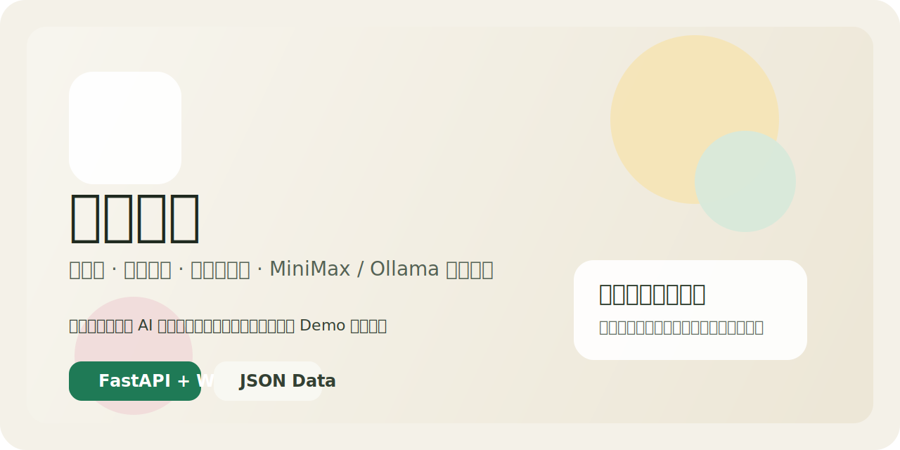

# Pig System / 猪猪系统

<p align="center">
  
</p>

<p align="center">
  <a href="https://github.com/fanko999/bigbigsys"></a>
  
  
  
  
</p>

<p align="center">
  A long-memory multi-role AI chat system with real server-side role isolation.
</p>

<p align="center">
  一套面向长期使用的多角色 AI 聊天系统，强调长期记忆、连续对话、低幻觉和可控数据。
</p>

## 中文简介

### 这是什么

猪猪系统不是单纯的聊天壳。

它的核心目标是做一套真正可长期运行的 AI 对话底座：

- 多角色
- 长期记忆
- 连续对话
- 用户认知
- 事实判断
- 低幻觉
- 可切换聊天模型、视觉模型、向量模型

### 这套系统的优势

- 一角色一套独立会话、记忆、成长数据，不是前端假分组
- 支持 MiniMax、Ollama、本地或远程 OpenAI 兼容 API
- 支持聊天模型、视觉模型、向量模型分开部署
- 支持网搜、看图、流式输出、角色导出导入
- 数据是 JSON 文件，方便备份、迁移、调试和魔改
- 更适合做长期陪伴型、人格型、私人助理型系统，而不是一次性 demo

### 核心能力

- 多角色独立记忆系统
- 全量聊天入长期记忆
- 结构化事实层与谨慎信息层
- 用户表达画像
- 两步分析再回答
- 角色 Prompt 管理
- 服务端角色隔离
- 向量检索 + Faiss 可选加速

### 适合谁

- 想做长期陪伴型 AI 的人
- 想做多角色人格系统的人
- 想把聊天模型和向量模型拆开的部署者
- 想保留本地可控数据，而不是全黑盒的人

## English Overview

### What is this

Pig System is not just a chat UI.

It is a long-running AI chat foundation focused on:

- long-term memory
- continuous conversations
- multi-role separation
- user understanding
- factual belief handling
- lower hallucination risk
- swappable chat, vision, and embedding models

### Why it matters

- Real server-side isolation for each role
- Flexible model routing: MiniMax, Ollama, OpenAI-compatible APIs
- Separate chat, vision, and embedding backends
- Exportable, portable, inspectable JSON data
- Built for long-term personal use, not a throwaway demo

### Main features

- role-isolated sessions, memories, and growth data
- full-chat memory archiving
- belief and conflict handling
- user utterance profiling
- two-step analyze-then-answer flow
- role prompt editing
- web search and image understanding
- optional Faiss acceleration

## Architecture

```text
frontend/index.html
    ↓
backend/main.py
    ↓
role_context.py
    ↓
memory_service.py / belief_service.py / utterance_service.py
    ↓
llm services / minimax / ollama / api-compatible providers
```

## Project Structure

```text
ai-web-chat/
├─ assets/
├─ backend/
│  ├─ main.py
│  ├─ config.py
│  ├─ role_context.py
│  ├─ requirements.txt
│  └─ services/
├─ frontend/
│  └─ index.html
├─ data/                  # ignored by git, local runtime data
├─ start_backend.bat
├─ start_frontend.bat
└─ README.md
```

## Requirements / 环境要求

### Python

- Recommended: `Python 3.11`
- `Python 3.14` is not recommended for this project yet

### Operating System

- Windows has been tested the most
- Linux can also run it, but startup scripts may need adjustment

### Backend dependencies

Install the base dependencies from:

```powershell
cd backend
python -m pip install -r requirements.txt
```

Main packages include:

- `fastapi`
- `uvicorn`
- `aiohttp`
- `pydantic`
- `python-multipart`
- `requests`
- `numpy`

### Optional dependency: Faiss

If you want vector index acceleration:

```powershell
python -m pip install faiss-cpu
```

If `faiss-cpu` is missing, the system can still run, but vector search/index rebuilding will degrade or be skipped.

## Model Setup / 模型接入方式

### Option A: MiniMax for chat + Ollama for embeddings

Recommended if you want:

- stable main chat model
- separate embedding service

You need:

- a valid `MINIMAX_API_KEY`
- an accessible Ollama embedding host
- at least one embedding model such as `bge-large`

### Option B: Ollama for everything

You need:

- a local or remote Ollama instance
- a chat model
- optionally a vision model
- an embedding model

### Option C: OpenAI-compatible API

You need:

- API base URL
- API key
- model names

## Installation / 安装步骤

### 1. Clone or copy the project / 克隆或复制项目

```powershell
cd C:\your\workspace
git clone https://github.com/fanko999/bigbigsys.git
cd bigbigsys\ai-web-chat
```

If you do not use `git clone`, copy the `ai-web-chat` directory manually.

### 2. Install Python dependencies / 安装依赖

```powershell
cd backend
python -m pip install -r requirements.txt
```

Optional:

```powershell
python -m pip install faiss-cpu
```

### 3. Configure environment variables / 配置环境变量

Recommended:

```powershell
$env:MINIMAX_API_KEY="your_real_key"
$env:MINIMAX_API_HOST="https://api.minimaxi.com/v1"
```

If you want them to persist, add them to your user environment variables in Windows.

### 4. Start the backend / 启动后端

```powershell
cd backend
python -m uvicorn main:app --host 0.0.0.0 --port 5181
```

Or use:

```powershell
..\start_backend.bat
```

### 5. Start the frontend / 启动前端

```powershell
cd ..
python -m http.server 5180
```

Or use:

```powershell
start_frontend.bat
```

### 6. Open the app / 打开网页

- Frontend: `http://127.0.0.1:5180`
- Backend: `http://127.0.0.1:5181`

## First Run / 首次使用建议

Recommended order:

1. confirm backend root endpoint works
2. open the frontend page
3. check the global model settings
4. set provider, chat model, vision model, embedding model
5. verify API key or Ollama addresses
6. create or edit a role
7. start a test conversation

## Usage / 用法

### Global model settings / 全局模型设置

The right panel controls shared model settings:

- provider
- chat model
- vision model
- embedding model
- Ollama hosts
- API base URL
- API key
- temperature
- two-step analysis

这些模型设置是全局共享的，不再和角色人设混在一起。

### Role settings / 角色设置

Role editing is separate from model settings.

Each role contains:

- name
- avatar
- description
- prompt

Each role gets its own server-side data space:

- sessions
- memory
- growth
- config

### Web search / 网搜

You can trigger web search explicitly from the UI.

The backend can also trigger it when the user clearly asks for recent external information such as:

- latest news
- latest reports
- recent online updates
- help me search online

### Vision / 看图

Image flow priority:

1. if the main chat model is multimodal, use it first
2. otherwise try MiniMax image understanding
3. otherwise fall back to the configured vision model

## Memory System / 记忆系统说明

The memory pipeline is designed for long-term use.

Current behavior:

- all chat messages are stored in sessions
- all chat messages are archived into long-term memory
- embeddings are generated for long-term memory entries
- related memories are retrieved for later turns
- beliefs and user profile layers help the model answer more consistently

Additional cognition layers include:

- belief extraction
- conflict detection
- cautious facts vs. trusted facts
- user utterance type profiling

## Streaming / 流式输出

The project supports real streaming and smoothed rendering.

Current practical behavior:

- MiniMax/API-compatible paths can use real backend streaming
- Ollama chat can fall back to non-stream backend responses with frontend typewriter rendering for better stability

## API Summary

### System

- `GET /`
- `GET /api/models`

### Roles

- `GET /api/roles`
- `POST /api/roles`
- `GET /api/roles/{role_id}`
- `PUT /api/roles/{role_id}`
- `DELETE /api/roles/{role_id}`
- `GET /api/roles/{role_id}/export`
- `POST /api/roles/import`

### Sessions

- `GET /api/sessions`
- `POST /api/sessions`
- `GET /api/sessions/{session_id}`
- `DELETE /api/sessions/{session_id}`

### Chat

- `POST /api/chat`
- `POST /api/chat/stream`

### Memories

- `GET /api/roles/{role_id}/memories`
- `PUT /api/roles/{role_id}/memories/{memory_id}`
- `DELETE /api/roles/{role_id}/memories/{memory_id}`

### Internal cognition helpers

- beliefs
- user profile
- memory search

## Security Notes / 安全提示

Do not commit:

- real API keys
- `data/` runtime conversations
- local vector index data
- logs and temp files

This repo ignores `data/` by default.

If a real API key was ever exposed before, rotate it immediately.

## GitHub Publishing Notes / 发布说明

For public publishing:

- keep code and docs in git
- keep local runtime data out of git
- prefer environment variables for secrets
- document your model routing clearly

This repository is meant to be a usable public codebase, while your real private conversations and memories remain local.

## Troubleshooting / 常见问题

### `No module named 'faiss'`

Install:

```powershell
python -m pip install faiss-cpu
```

### Chat works but memory retrieval feels weak

Check:

- embedding host
- embedding model
- whether embeddings are being generated successfully
- whether your Ollama or remote embedding service is reachable

### Ollama feels unstable

Common causes:

- low context length
- high temperature
- unstable remote forwarding
- incomplete payloads in streaming mode

Recommended:

- use a larger context window
- lower temperature
- test locally if possible

## Roadmap Direction / 后续方向

This project is best evolved as a general long-memory AI foundation, not a single-purpose vertical app.

That means future improvements should continue focusing on:

- memory quality
- role stability
- continuity across long conversations
- lower hallucination
- stronger user understanding

## License

No license file is included yet.

If you want this repository to be clearly reusable by others, add a license such as MIT later.
